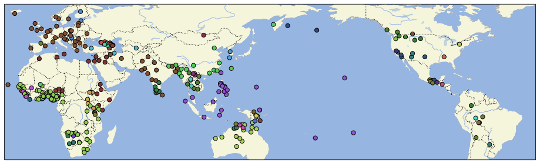

# CLDF dataset derived from "The UCLA Phonetics Lab Archive" from 2009

## How to cite

If you use these data please cite
- the original source
  > Ladefoged, P., Blankenship, B., Schuh, R. G., Jones, P., Gfroerer, N., Griffiths, E., Harrington, L., Hipp, C., Jones, P., Kaneko, M, Moore-Cantwell, C., Oh, G., Pfister, K., Vaughan, K., Videc, R., Weismuller, S., Weiss, S., White, J., Conlon, S., Lee, WS. J., and Toribio, R. (2009). The UCLA Phonetics Lab Archive. Los Angeles, CA: UCLA Department of Linguistics. http://archive.phonetics.ucla.edu
- the derived dataset using the DOI of the [particular released version](../../releases/) you were using

## Description

This dataset is licensed under a CC-BY-NC-2.0 license

Available online at http://archive.phonetics.ucla.edu/

### Notes

From http://archive.phonetics.ucla.edu/ :

> For over half a century, the UCLA Phonetics Laboratory has collected recordings of hundreds of 
> languages from around the world, providing source materials for phonetic and phonological 
> research, of value to scholars, speakers of the languages, and language learners alike. The 
> materials on this site comprise audio recordings illustrating phonetic structures from over 
> 200 languages with phonetic transcriptions, plus scans of original field notes where relevant.

> Contents of this site are licensed under a Creative Commons license. You are free to copy, 
> distribute, or adapt these materials for noncommercial purposes, under the following conditions:
> - For any reuse or distribution, you must make clear to others the license terms of this work.
> - Any derivative work may be distributed only under a license identical to this one. That is, you cannot claim exclusive right to any creation based on these materials, nor can anyone who further adapts your creation.
> - Please attribute the material to the UCLA Phonetics Lab Archive. See below for suggested citation format.

### Coverage

The CLDF dataset contains all textual data and metadata from http://archive.phonetics.ucla.edu/ and
provides URLs of all media files associated with recordings on http://archive.phonetics.ucla.edu/

The dataset covers all languages represented in the archive.

*Languages represented in the archive color-coded by language family.*

### Dataset schema

The following entity-relationship diagram shows how the tables of the dataset are related. For
detailed descriptions of the individual columns, see [the CLDF README](cldf/README.md).

## CLDF Datasets

The following CLDF datasets are available in [cldf](cldf):

- CLDF [Wordlist](https://github.com/cldf/cldf/tree/master/modules/Wordlist) at [cldf/Wordlist-metadata.json](cldf/Wordlist-metadata.json)